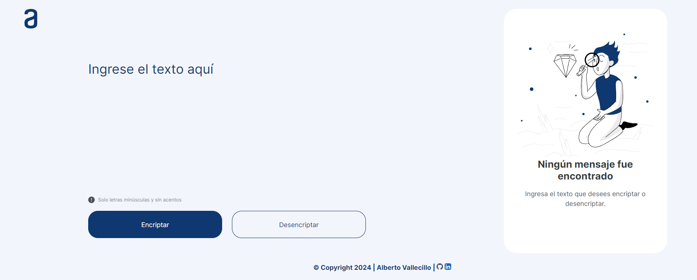

<em> # Encriptador / Desencriptador de Texto </em>

# 🎯 Challenge Encriptador / Alura Latam + Oracle ONE 🎯

  


## 📝 Descripción 📝

Esta aplicación forma parte del desafío del programa Alura / ONE, se trata de desarrollar una aplicación que encripte textos.

Este repositorio contiene mi solución para el challenge y permite encriptar y desencriptar mensajes mediante una técnica de encriptación simple.

Pude practicar y desarrollar programación utilizando HTML, CSS y JavaScript para la creación de una página web.

## ✳️ Requisitos ✳️

- Debe funcionar solo con letras minúsculas
- No deben ser utilizados letras con acentos ni caracteres especiales
- Debe ser posible convertir una palabra para la versión encriptada también devolver una palabra encriptada para su versión original.

Por ejemplo:
"gato" => "gaitober"
gaitober" => "gato"

- La página debe tener campos para inserción del texto que será encriptado o desencriptado, y el usuario debe poder escoger entre las dos opciones.

- El resultado debe ser mostrado en la pantalla.

Extras:

- Un botón que copie el texto encriptado/desencriptado para la sección de transferencia, o sea que tenga la misma funcionalidad del ctrl+C o de la opción "copiar" del menú de las aplicaciones.

## 💻 Funcionamiento 💻 🏃
Las "llaves" de encriptación que utilizaremos son las siguientes:

### 🔐 Encriptación 🔐
| Entrada | Salida |
|---------|--------|
|    e    | enter  |
|    i    | imes   |
|    a    | ai     |
|    o    | ober   |
|    u    | ufat   |

Ejemplo:
```sh
"murcielago" --> "mufatrcimesenterlaigober"
```

### 🔓🔑 Desencriptación 🔓🔑
| Entrada | Salida |
|---------|--------|
| enter   |    e   |
| imes    |    i   |
| ai      |    a   |
| ober    |    o   |
| ufat    |    u   |

Ejemplo:
```sh
"mufatrcimesenterlaigober" --> "murcielago"
```

## 👷Autor: Alberto Vallecillo 👷
<a href="https://linkedin.com/in/alberto-vallecillo" target="_blank">

</a>
<a href="https://github.com/Alb3rtoGitHub" target="_blank">

</a> 
  